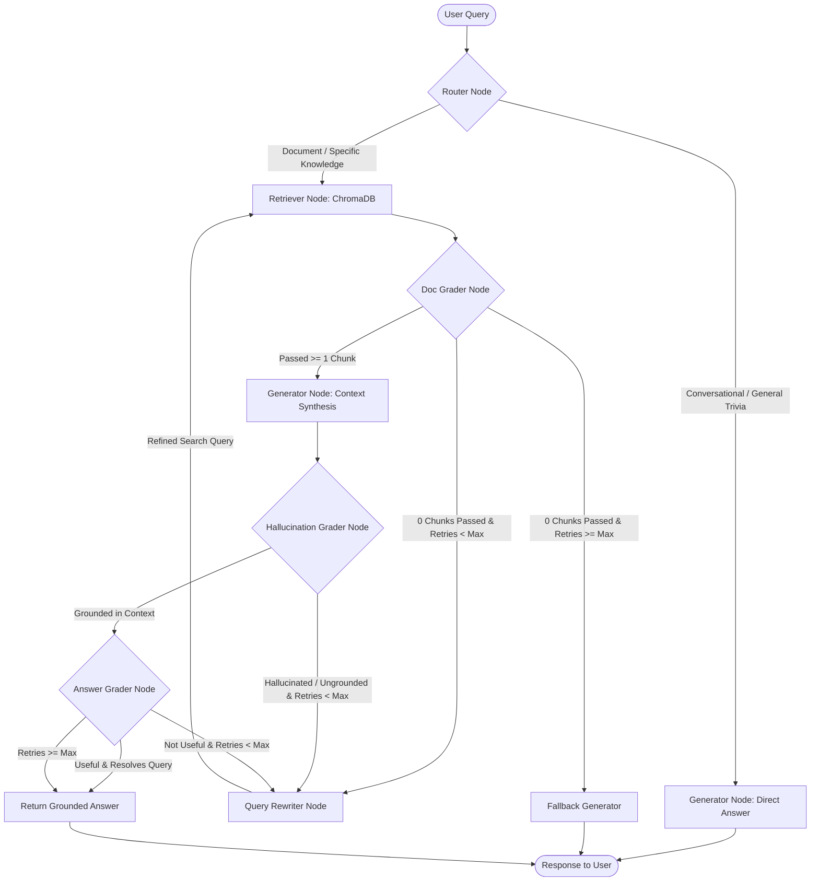

# Project Implementation Plan: Self-Correcting Agentic RAG System

## 1. Executive Summary & Objective
Standard Retrieval-Augmented Generation (RAG) pipelines suffer from critical failure modes:
1. **Irrelevant Retrieval**: Vector search often retrieves noisy or off-topic context chunks.
2. **Hallucinations**: Generative LLMs may extrapolate beyond retrieved context or fabricate ungrounded assertions.
3. **Question-Answer Mismatch**: Answers may be grounded in retrieved facts but fail to directly answer the user's specific intent.
4. **Fragility / Lack of Recovery**: When retrieval fails, standard pipelines have no self-correction mechanisms and simply return hallucinated or unhelpful responses.

**Objective**: Architect and implement an enterprise-grade **Self-Correcting Agentic RAG System** using **LangGraph**, **FastAPI**, **ChromaDB**, **PostgreSQL Checkpointing**, and a **Hybrid LLM/Embedding Layer (Google Gemini + Local/Tailscale Ollama)** that autonomously evaluates retrieval quality, detects hallucinations, reformulates failing queries via iterative retry loops, and maintains persistent conversation state across restarts.

---

## 2. Target Architecture & Component Design

---

## 3. Core Technical Stack

| Layer | Technology | Rationale |
| :--- | :--- | :--- |
| **Agentic Workflow Engine** | `LangGraph` (0.2.x) | Stateful, cyclical graph architecture supporting conditional branches and loops. |
| **State Persistence** | `langgraph-checkpoint-postgres` | PostgreSQL-backed checkpointer storing state snapshots across thread IDs. |
| **Vector Store** | `ChromaDB` (`langchain-chroma`) | Embedded HNSW vector database with persistent SQLite metadata storage. |
| **Cloud LLM & Embeddings** | `Google Gemini` (`langchain-google-genai`) | High-speed, high-context reasoning (`gemini-2.5-flash-lite`) and 3072-dim embeddings (`gemini-embedding-001`). |
| **Local / Offline LLM** | `Ollama` (`langchain-ollama`) | Private, local execution over LAN/Tailscale (`qwen2.5-coder:14b`, `llama3.1`). |
| **Web Service Layer** | `FastAPI` + `Uvicorn` | High-throughput asynchronous REST API with automatic OpenAPI documentation. |
| **Document Processing** | `pypdf`, `langchain-text-splitters` | Universal ingestion supporting PDF, Markdown, Text, and JSON. |
| **CLI & Observability** | `Rich` | Interactive REPL with real-time agent execution trace tables. |
| **Test Framework** | `pytest`, `pytest-asyncio` | Automated unit, integration, and E2E API test suites. |

---

## 4. Phased Implementation Roadmap

### Phase 1: Foundation, Environment & Unified Factory
- [x] Configure project directory structure (`app/`, `tests/`, `scripts/`, `data/`).
- [x] Define environment configuration management using Pydantic Settings (`app/core/config.py`).
- [x] Build unified, plug-and-play LLM and Embedding Factory (`app/core/llm_factory.py`) supporting dynamic provider switching (`gemini` vs `ollama`).
- [x] Initialize centralized structured logging with standardized formatting (`app/core/logging.py`).

### Phase 2: Document Parsing & Vector Ingestion Pipeline
- [x] Implement multi-format text extraction supporting PDF (`pypdf`), Markdown, Text, and JSON (`app/services/document_service.py`).
- [x] Configure recursive character chunking with configurable overlap (600 char size, 100 char overlap).
- [x] Implement persistent ChromaDB vector store singleton (`app/services/vector_service.py`).
- [x] Add automated clean re-seeding, document removal by source, and collection wipe mechanisms.
- [x] Create standalone database seeding utility (`scripts/seed_data.py`).

### Phase 3: LangGraph Agentic Workflow & Grading Nodes
- [x] Define typed `AgentState` schema storing query, documents, rewritten queries, retry counters, and trace logs (`app/agent/state.py`).
- [x] Define Pydantic structured output evaluation schemas (`RouteQuery`, `GradeDocument`, `GradeHallucinations`, `GradeAnswer`, `QueryRewrite`) in `app/schemas/evaluation.py`.
- [x] Implement specialized system prompts with few-shot in-context guidance (`app/agent/prompts/`):
  - `router.py`: Distinguishes general world trivia/greetings from internal document queries.
  - `grading.py`: Enforces strict topical relevance and factual grounding checks.
  - `rewriting.py`: Context-aware query expansion for failing retrieval loops.
  - `generation.py`: Context-grounded and direct response generation.
- [x] Construct node functions (`app/agent/nodes/`):
  - `router_node`, `retrieve_node`, `grade_documents_node`, `generate_rag_answer_node`, `rewrite_query_node`, `grade_hallucination_node`, `grade_answer_node`, `generate_direct_answer_node`, `generate_fallback_node`.
- [x] Assemble the cyclic `StateGraph` workflow with conditional edge routers and maximum retry guards (`app/agent/graph.py`).

### Phase 4: State Checkpointing & High-Level RAG Service
- [x] Configure PostgreSQL checkpointer integration (`PostgresSaver`) in Docker container (`ops-postgres:5433`).
- [x] Implement thread-safe `RAGService` orchestrator managing graph compilation, thread isolation, and response structuring (`app/services/rag_service.py`).
- [x] Guarantee cross-session checkpoint verification and memory recovery.

### Phase 5: REST API & Interactive CLI Interfaces
- [x] Build FastAPI REST API endpoints (`app/api/v1/`):
  - `POST /api/v1/rag/query`: Execute query and return answer + execution traces.
  - `POST /api/v1/documents/ingest/text`: Ingest raw text snippets.
  - `POST /api/v1/documents/ingest/file`: Upload and ingest PDF/TXT/MD files.
  - `POST /api/v1/documents/reset`: Wipe vector database collection.
  - `GET /api/v1/documents/stats`: Retrieve vector database collection metrics.
  - `GET /api/v1/health`: System health and dependency checks.
- [x] Implement interactive CLI REPL (`scripts/cli.py`) with rich execution tables, summary metrics, and slash commands (`/seed`, `/reset`, `/ingest`, `/stats`, `/help`).

### Phase 6: Automated Testing & Verification
- [x] Build unit tests for routing and grading conditional edges (`tests/unit/test_router.py`, `tests/unit/test_graders.py`).
- [x] Build integration tests for compiled graph flow and retry limits (`tests/integration/test_graph_flow.py`).
- [x] Build E2E API tests validating FastAPI endpoints and file uploads (`tests/e2e/test_api_endpoints.py`).
- [x] Verify 100% test pass rate across all 14 test suites (`pytest tests/ -v`).

---

## 5. Failure Modes & Self-Correction Matrix

| Failure Scenario | Detection Mechanism | Self-Correction Action | Fallback Outcome |
| :--- | :--- | :--- | :--- |
| **Noisy / Irrelevant Retrieval** | `DocGraderNode` outputs `binary_score='no'` for all top-$k$ chunks. | Triggers `RewriterNode` to expand/reformulate query terms; re-runs retrieval. | If 3 retries exhausted: returns explicit knowledge base limitation message. |
| **Ungrounded Synthesis / Hallucination** | `HallucinationGraderNode` detects assertions not present in reference facts. | Rejects generated answer, increments retry counter, and triggers `RewriterNode`. | If retries exhausted: falls back to safe grounded summary. |
| **Ambiguous / Incomplete Query** | `AnswerGraderNode` detects synthesized answer did not resolve user intent. | Re-routes query through `RewriterNode` with specific failure context. | If retries exhausted: delivers best-effort verified answer with caveat. |
| **Remote Provider Downtime (Ollama/Tailscale)** | Node catch blocks in `llm_factory.py`. | Transparent fallback to Google Gemini (`gemini-2.5-flash-lite`). | System remains operational with zero service disruption. |

---

## 6. Success & Acceptance Criteria

1. **Self-Correction Autonomy**: System automatically retries and reformulates failing queries without manual user intervention.
2. **Zero Hallucination Tolerance**: Final answers in RAG path must be 100% grounded in reference document context.
3. **Session Thread Continuity**: Multi-turn conversation states snapshot-saved to PostgreSQL checkpointer.
4. **Latency & Performance**: Sub-second end-to-end execution on cloud Gemini models; local execution support via Ollama.
5. **Code Quality & Maintainability**: Clean modular design with 100% automated test coverage.
